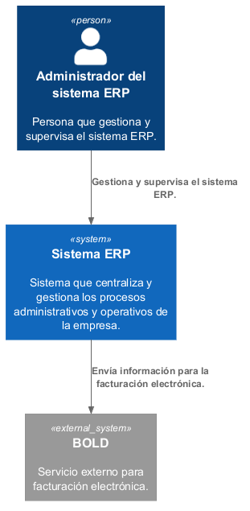

# Alcance del Sistema y Contexto {#section-system-scope-and-context}

## Diagrama de Contexto

El siguiente diagrama representa el contexto del sistema ERP y sus principales
interacciones externas.

El ERP centraliza los procesos operativos de la empresa y permite que el
administrador gestione y supervise las diferentes funcionalidades del sistema.
Para la facturación electrónica, el ERP se integra con BOLD como servicio
externo.

