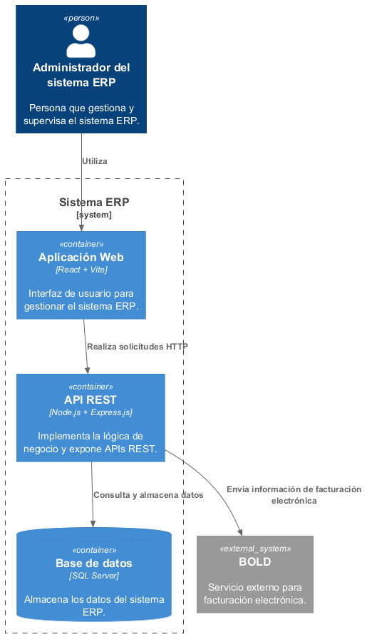

# Vista de Bloques {#section-building-block-view}

## Sistema General de Caja Blanca {#_sistema_general_de_caja_blanca}

### Motivación

El sistema ERP se estructura inicialmente mediante una arquitectura monolítica,
organizada en tres contenedores principales: una aplicación web, una API REST
y una base de datos relacional.

Esta estructura permite separar las responsabilidades de presentación,
lógica de negocio y persistencia de datos, facilitando el mantenimiento y la
evolución progresiva del sistema.

### Bloques de construcción contenidos

Los principales bloques de construcción del sistema ERP son:

- **Aplicación Web (SPA):** proporciona la interfaz de usuario y permite
  interactuar con las funcionalidades del ERP.
- **API REST:** implementa la lógica de negocio y proporciona los servicios
  necesarios para la comunicación con el frontend.
- **Base de Datos:** almacena de forma persistente la información del ERP.

### Interfaces importantes

La aplicación web se comunica con la API REST mediante servicios HTTP
utilizando una interfaz API REST.

La API REST se comunica con SQL Server para consultar y modificar la
información persistente del sistema.

La API REST también puede comunicarse con sistemas externos, como BOLD,
cuando se requiere utilizar servicios de facturación electrónica.

### Aplicación Web (SPA)

**Propósito / Responsabilidad**

Proporcionar la interfaz mediante la cual los usuarios interactúan con el
sistema ERP.

**Tecnologías**

React y Vite.

**Interfaz**

Consume los servicios expuestos por la API REST mediante solicitudes HTTP.

### API REST

**Propósito / Responsabilidad**

Implementar la lógica de negocio del ERP y gestionar las operaciones
solicitadas por la aplicación web.

**Tecnologías**

Node.js y Express.js.

**Interfaz**

Expone servicios mediante una API REST y se comunica con la base de datos y
los servicios externos requeridos.

### Base de Datos

**Propósito / Responsabilidad**

Almacenar y gestionar de forma persistente la información generada por los
módulos del ERP.

**Tecnología**

SQL Server.

**Interfaz**

La comunicación con la base de datos es realizada por la API REST.

## Nivel 2

No se desarrolla un nivel adicional de bloques de construcción en esta
versión de la arquitectura, debido a que el alcance del proyecto se limita
al diseño de alto nivel del sistema ERP.
