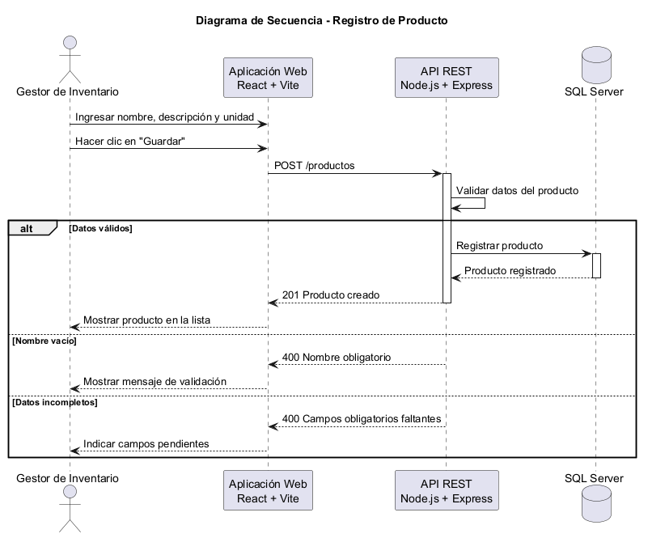

# Vista de Ejecución {#section-runtime-view}

## Escenario: Registro de Producto

### Historia de Usuario

> Como gestor de inventario, quiero registrar nuevos productos con su
> información básica (nombre, descripción y unidad), para que pueda mantener
> un catálogo actualizado para las compras.

### Diagrama de Secuencia

El siguiente diagrama representa la interacción entre el gestor de inventario,
la aplicación web, la API REST y la base de datos durante el registro de un
nuevo producto.

### Flujo

1. El gestor de inventario accede a la funcionalidad de registro de productos
   desde la aplicación web.
2. El usuario introduce el nombre, descripción y unidad del producto.
3. La aplicación web envía la información a la API REST.
4. La API REST valida los datos recibidos.
5. Si los datos son válidos, la API registra el producto en SQL Server.
6. La base de datos confirma el registro.
7. La API REST devuelve una respuesta satisfactoria a la aplicación web.
8. La aplicación web informa al gestor de inventario que el producto fue
   registrado correctamente y actualiza la lista de productos.

### Manejo de validaciones

Si el usuario intenta registrar el producto sin completar los campos
obligatorios, la aplicación debe mostrar un mensaje de validación y evitar el
registro.

Esto corresponde a los criterios de aceptación definidos para la historia de
usuario de Registro de Producto.