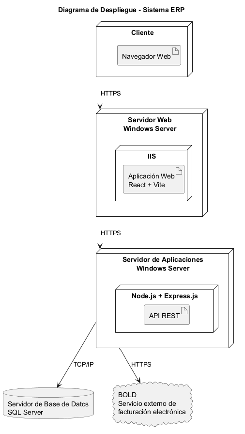

# Vista de Despliegue {#section-deployment-view}

## Nivel de infraestructura 1 {#_nivel_de_infraestructura_1}

### Motivación

La arquitectura se desplegará utilizando tres servidores independientes con
el objetivo de separar las responsabilidades de presentación, procesamiento
de la lógica de negocio y almacenamiento de datos.

Esta separación permite aislar los componentes principales del sistema ERP,
facilitar su mantenimiento y mejorar la seguridad de la información,
especialmente al mantener la base de datos separada de los servicios
accesibles directamente por los usuarios.

### Características de Calidad/Rendimiento

La separación de los servidores permite:

- Aislar la base de datos del acceso directo de los usuarios.
- Aplicar políticas de seguridad independientes para cada servidor.
- Facilitar el mantenimiento y actualización de cada componente.
- Permitir escalar los servidores de aplicación y web de forma independiente
  si aumenta la demanda.
- Reducir el impacto que podría producir una falla en uno de los componentes.
- Facilitar la implementación de mecanismos de monitoreo, respaldo y
  recuperación.

### Mapeo de los Bloques de Construcción a Infraestructura

| Bloque de construcción | Infraestructura | Responsabilidad |
|---|---|---|
| Aplicación Web (SPA) | Servidor Web | Alojar y entregar la aplicación React al usuario. |
| API REST | Servidor de Aplicaciones | Ejecutar Node.js + Express.js y procesar la lógica de negocio. |
| Base de Datos | Servidor de Base de Datos | Ejecutar SQL Server y almacenar la información del ERP. |
| Integración con BOLD | Servidor de Aplicaciones | Realizar las comunicaciones con el servicio externo mediante HTTPS. |

## Nivel de Infraestructura 2 {#_nivel_de_infraestructura_2}

### Servidor Web {#_servidor_web}

**Sistema operativo:** Windows Server.

**Software:** IIS.

**Responsabilidad:** alojar y entregar al usuario la aplicación web construida
con React y Vite.

La aplicación React será compilada mediante Vite y el resultado de la
compilación será desplegado como archivos estáticos en el servidor web.